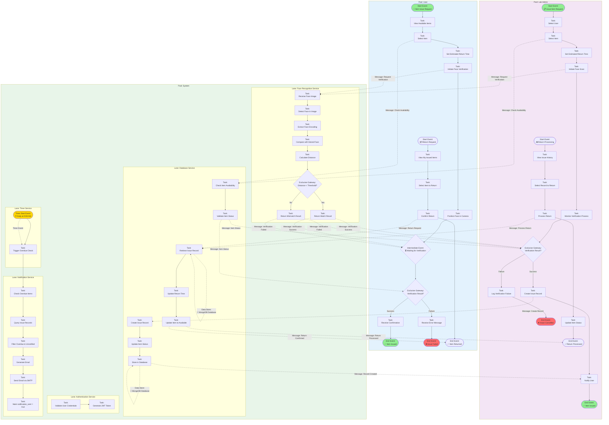
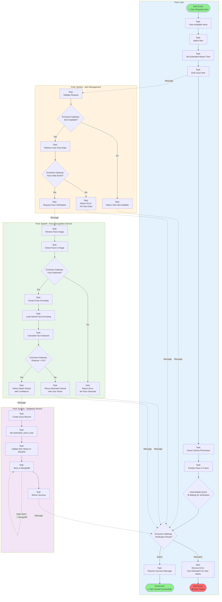
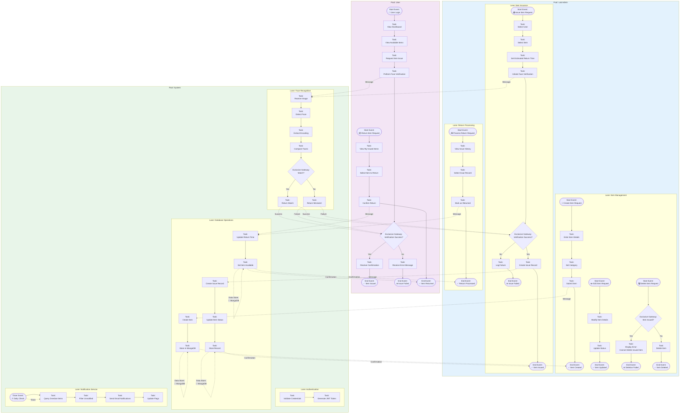

# Complete BPMN Process Diagram
## Laboratory Items Issue Management System - Main Business Process

This document contains a comprehensive BPMN 2.0 diagram showing the complete business process for the Laboratory Items Issue Management System, using pools and lanes similar to professional BPMN modeling tools.

---

## Main Business Process: Item Issuance and Management

This diagram shows the complete workflow with three main participants (pools) and their internal processes (lanes).

---

## Detailed Process Flow: Item Issuance with Face Verification

This diagram provides a more detailed view of the item issuance process with all decision points and error handling.

---

## Complete Item Lifecycle Process with Pools and Lanes

This comprehensive diagram shows the complete item lifecycle from creation to return, including all participants and system services.

---

## BPMN Element Legend

### Events
- **Start Event** (Circle with thin border): Process initiation
  - 📧 Message Start Event
  - ⏰ Timer Start Event
  - 📝 Manual Start Event
- **End Event** (Circle with thick border): Process completion
  - ✅ Success End Event
  - ❌ Error End Event
- **Intermediate Event** (Circle with double border): Event during execution
  - ⏳ Waiting/Catching Event

### Activities
- **Task** (Rounded rectangle): Work performed
  - User Task: Performed by human
  - Service Task: Performed by automated service
  - Script Task: Performed by script

### Gateways
- **Exclusive Gateway** (Diamond with X): Decision point - only one path taken
- **Parallel Gateway** (Diamond with +): Multiple paths taken simultaneously
- **Inclusive Gateway** (Diamond with O): One or more paths taken

### Flow Objects
- **Sequence Flow** (Solid arrow): Order of activities within a pool
- **Message Flow** (Dashed arrow with dot): Communication between pools
- **Association** (Dotted line): Links artifacts to flow objects

### Artifacts
- **Data Store** (Cylinder icon 💾): Persistent data storage
- **Pool**: Represents a participant in the process
- **Lane**: Represents a sub-partition within a pool

---

## Process Participants

### Pool 1: User
- **Role**: End user who requests and returns items
- **Responsibilities**: 
  - View available items
  - Request item issuance
  - Perform face verification
  - Return items

### Pool 2: Lab Admin
- **Role**: Laboratory administrator managing items and users
- **Responsibilities**:
  - Create and manage items
  - Issue items to users
  - Process returns
  - Monitor issue history

### Pool 3: System
- **Role**: Automated system services
- **Lanes**:
  - **Authentication Service**: User authentication and authorization
  - **Face Recognition Service**: Biometric verification
  - **Database Service**: Data persistence and retrieval
  - **Notification Service**: Automated email notifications
  - **Timer Service**: Scheduled tasks and triggers

---

## Key Process Flows

### 1. Item Issuance Flow
1. User/Lab Admin initiates item issue request
2. System validates item availability
3. Face verification process is triggered
4. Face recognition service compares faces
5. On success: Issue record is created
6. Item status is updated to ISSUED
7. Confirmation is sent to user

### 2. Item Return Flow
1. User/Lab Admin initiates return request
2. System retrieves issue record
3. Return time is updated
4. Item status is updated to AVAILABLE
5. Confirmation is sent

### 3. Overdue Notification Flow
1. Timer service triggers daily check
2. System queries overdue items
3. Filters unnotified records
4. Generates and sends email notifications
5. Updates notification flags

---

**Document Version**: 1.0  
**Last Updated**: 2024  
**BPMN Version**: 2.0  
**Status**: Final  
**Modeling Tool**: Mermaid (BPMN-compatible notation)

