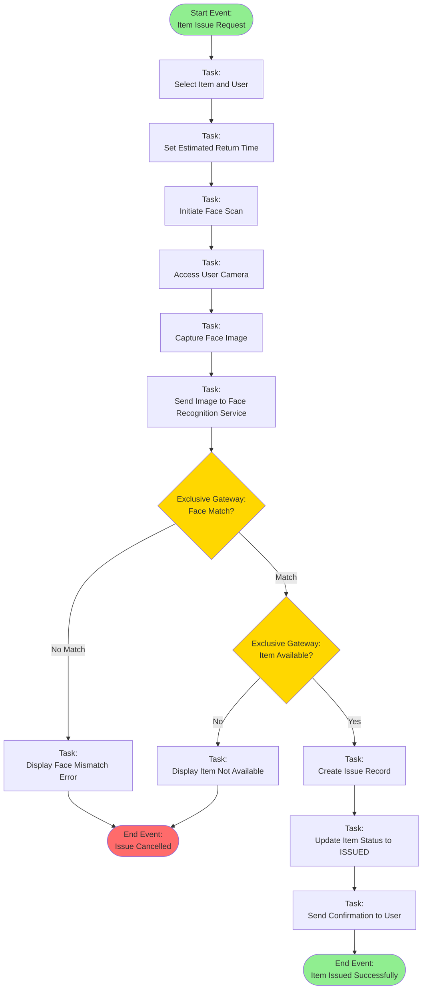
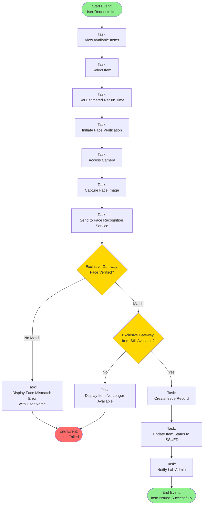
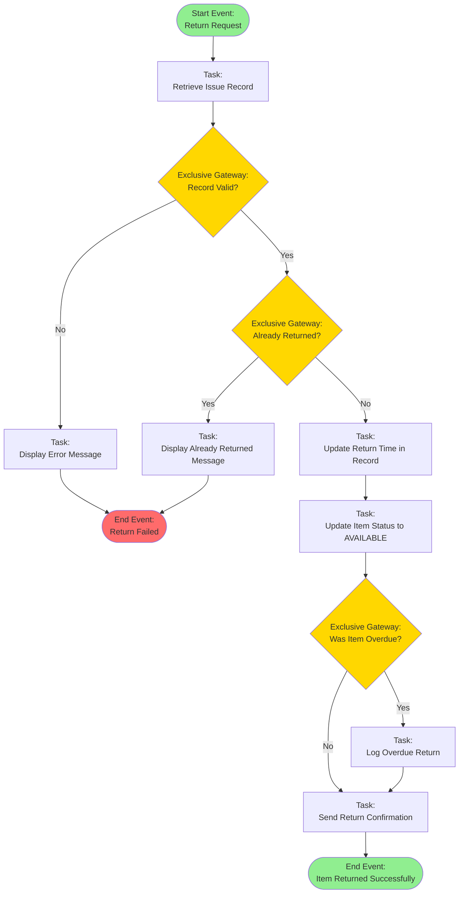
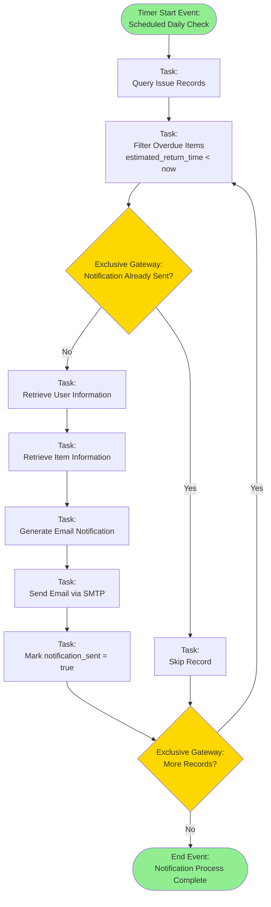
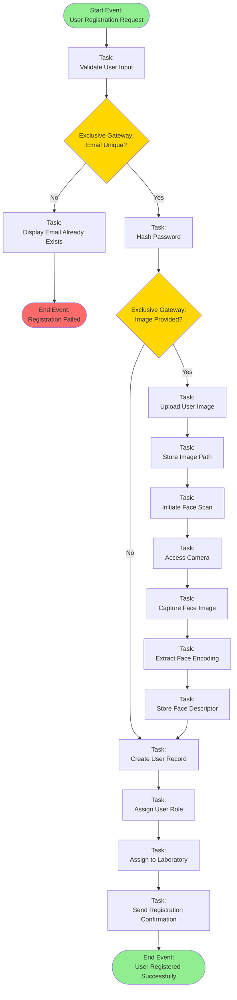
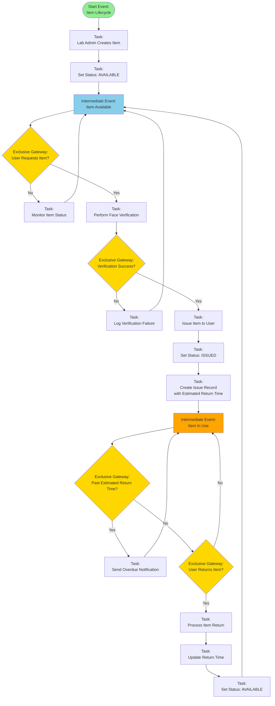
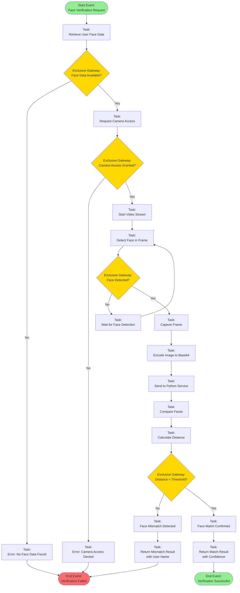
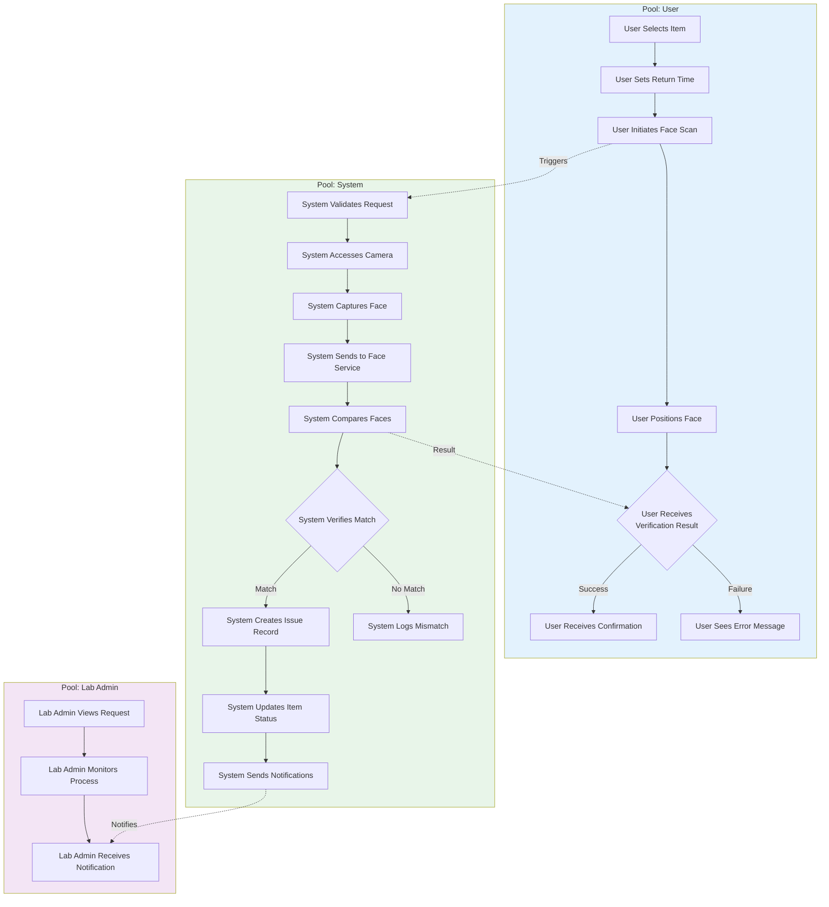
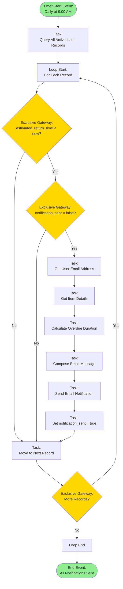
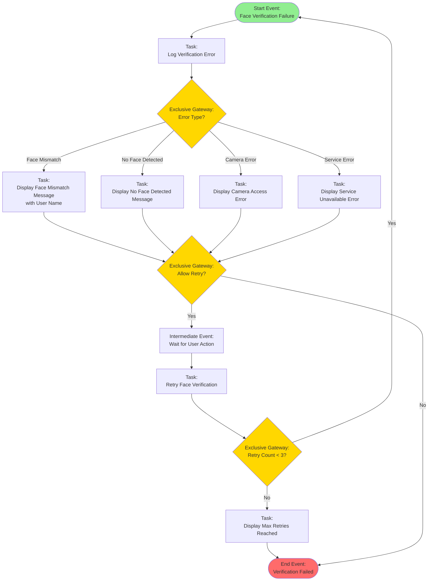

# Business Process Model and Notation (BPMN) Diagrams
## Laboratory Items Issue Management System

This document contains standard BPMN 2.0 diagrams representing the key business processes in the Laboratory Items Issue Management System.

> **For a comprehensive BPMN diagram with Pools and Lanes (similar to professional BPMN modeling tools), see [BPMN_COMPLETE_PROCESS.md](./BPMN_COMPLETE_PROCESS.md)**

---

## 1. Item Issuance Process (Lab Admin)

This process represents the workflow when a Lab Admin issues an item to a user, including face verification.

---

## 2. Item Issuance Process (User Self-Service)

This process represents the workflow when a User issues an item themselves with face verification.

---

## 3. Item Return Process

This process represents the workflow for returning an issued item.

---

## 4. Overdue Item Notification Process

This process represents the automated workflow for detecting and notifying users about overdue items.

---

## 5. User Registration Process (With Face Capture)

This process represents the workflow for creating a new user with optional face descriptor capture.

---

## 6. Complete Item Lifecycle Process

This comprehensive process shows the complete lifecycle of an item from creation to return.

---

## 7. Face Verification Sub-Process

This detailed sub-process shows the face verification workflow used in item issuance.

---

## 8. Pool and Lane Diagram: Item Issuance Process

This BPMN pool diagram shows the interaction between different participants (User, Lab Admin, System) in the item issuance process.

---

## 9. Event-Driven Process: Overdue Item Monitoring

This process shows the event-driven workflow for monitoring and handling overdue items.

---

## 10. Error Handling Process: Face Verification Failure

This process shows the error handling workflow when face verification fails.

---

## BPMN Element Legend

### Events
- **Start Event** (Circle with thin border): Process initiation point
- **End Event** (Circle with thick border): Process completion point
- **Intermediate Event** (Circle with double border): Event during process execution
- **Timer Event** (Clock icon): Time-based trigger

### Activities
- **Task** (Rounded rectangle): Work performed in the process
- **User Task**: Task performed by a human
- **Service Task**: Task performed by an automated service
- **Script Task**: Task performed by a script

### Gateways
- **Exclusive Gateway** (Diamond with X): Decision point - only one path is taken
- **Parallel Gateway** (Diamond with +): Multiple paths taken simultaneously
- **Inclusive Gateway** (Diamond with O): One or more paths taken

### Flow Objects
- **Sequence Flow** (Solid arrow): Order of activities
- **Message Flow** (Dashed arrow): Communication between pools
- **Association** (Dotted line): Links artifacts to flow objects

### Artifacts
- **Data Object**: Data used or produced in the process
- **Annotation**: Additional information about the process

---

## Process Summary

### Main Business Processes

1. **Item Issuance (Lab Admin)**: Complete workflow for Lab Admin issuing items with face verification
2. **Item Issuance (User Self-Service)**: User-initiated item issuance with face verification
3. **Item Return**: Process for returning issued items
4. **Overdue Notification**: Automated process for detecting and notifying about overdue items
5. **User Registration**: Process for creating new users with optional face capture
6. **Item Lifecycle**: Complete lifecycle from creation to return
7. **Face Verification**: Detailed sub-process for face recognition
8. **Error Handling**: Comprehensive error handling for verification failures

### Key Features Represented

- ✅ Face recognition verification
- ✅ Role-based access control
- ✅ Automated notifications
- ✅ Error handling and retry logic
- ✅ Multi-participant processes
- ✅ Event-driven workflows
- ✅ Timer-based automation

---

**Document Version**: 1.0  
**Last Updated**: 2024  
**BPMN Version**: 2.0  
**Status**: Final

