# Laboratory Items Issue Management System - Updated Diagrams

## 1. System Architecture Diagram

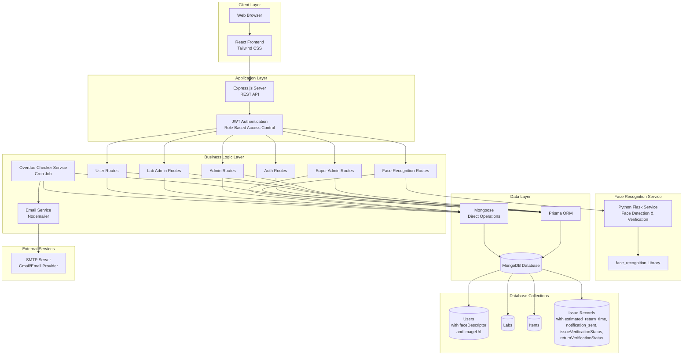

## 2. User Flow Diagrams

### 2.1 Super Admin Flow

```mermaid
flowchart TD
    START([Super Admin Login]) --> DASH[Super Admin Dashboard]
    DASH --> CREATE_ADMIN[Create Admin]
    DASH --> CREATE_LAB[Create Lab]
    DASH --> ASSIGN[Assign Admin to Lab]
    DASH --> VIEW_ADMINS[View All Admins]
    DASH --> VIEW_LABS[View All Labs]
    DASH --> REPORTS[System Reports]
    
    CREATE_ADMIN --> FORM1[Fill Admin Details]
    FORM1 --> SUBMIT1[Submit]
    SUBMIT1 --> SUCCESS1[Admin Created]
    SUCCESS1 --> DASH
    
    CREATE_LAB --> FORM2[Fill Lab Details<br/>Select Admin]
    FORM2 --> SUBMIT2[Submit]
    SUBMIT2 --> SUCCESS2[Lab Created]
    SUCCESS2 --> DASH
    
    ASSIGN --> SELECT_LAB[Select Lab]
    SELECT_LAB --> SELECT_ADMIN[Select Admin]
    SELECT_ADMIN --> SUBMIT3[Submit]
    SUBMIT3 --> SUCCESS3[Admin Assigned]
    SUCCESS3 --> DASH
    
    VIEW_ADMINS --> EDIT_ADMIN[Edit Admin]
    VIEW_ADMINS --> DELETE_ADMIN[Delete Admin]
    EDIT_ADMIN --> FORM_EDIT_ADMIN[Update Admin Details<br/>Name, Email, Password]
    FORM_EDIT_ADMIN --> SUBMIT_EDIT_ADMIN[Submit]
    SUBMIT_EDIT_ADMIN --> SUCCESS_EDIT_ADMIN[Admin Updated]
    SUCCESS_EDIT_ADMIN --> DASH
    
    DELETE_ADMIN --> CONFIRM_DELETE_ADMIN[Confirm Deletion]
    CONFIRM_DELETE_ADMIN --> CHECK_ADMIN_LABS{Admin Assigned<br/>to Labs?}
    CHECK_ADMIN_LABS -->|Yes| ERROR_ADMIN[Error: Cannot Delete<br/>Reassign Labs First]
    CHECK_ADMIN_LABS -->|No| SUCCESS_DELETE_ADMIN[Admin Deleted]
    ERROR_ADMIN --> DASH
    SUCCESS_DELETE_ADMIN --> DASH
    
    VIEW_LABS --> EDIT_LAB[Edit Lab]
    VIEW_LABS --> DELETE_LAB[Delete Lab]
    EDIT_LAB --> FORM_EDIT_LAB[Update Lab Details<br/>Name, Department, Admin]
    FORM_EDIT_LAB --> SUBMIT_EDIT_LAB[Submit]
    SUBMIT_EDIT_LAB --> SUCCESS_EDIT_LAB[Lab Updated]
    SUCCESS_EDIT_LAB --> DASH
    
    DELETE_LAB --> CONFIRM_DELETE_LAB[Confirm Deletion]
    CONFIRM_DELETE_LAB --> CHECK_LAB_DATA{Lab Has Items<br/>Users, or Records?}
    CHECK_LAB_DATA -->|Yes| ERROR_LAB[Error: Cannot Delete<br/>Remove Related Data First]
    CHECK_LAB_DATA -->|No| SUCCESS_DELETE_LAB[Lab Deleted]
    ERROR_LAB --> DASH
    SUCCESS_DELETE_LAB --> DASH
    
    DASH --> CREATE_USER[Create User]
    CREATE_USER --> SELECT_LAB_USER[Select Lab]
    SELECT_LAB_USER --> FORM_USER[Fill User Details]
    FORM_USER --> FACE_SCAN_USER[Scan Face Image<br/>Capture Face Descriptor]
    FACE_SCAN_USER --> SUBMIT_USER[Submit]
    SUBMIT_USER --> SUCCESS_USER[User Created<br/>with Face Data]
    SUCCESS_USER --> DASH
    
    DASH --> VIEW_USERS[View All Users]
    VIEW_USERS --> USER_LIST[Display All Users<br/>with Lab & Admin Info]
    USER_LIST --> DASH
    
    DASH --> VIEW_ITEMS[View All Items]
    VIEW_ITEMS --> ITEM_LIST[Display All Items<br/>with Lab, Status,<br/>Filter by Status/Lab]
    ITEM_LIST --> DASH
    
    REPORTS --> SELECT_REPORT_TYPE{Select Report Type}
    SELECT_REPORT_TYPE -->|Overview| OVERVIEW_REPORT[System Overview<br/>All Admins, Labs, Users,<br/>Lab Admins, Items with States, Issues]
    SELECT_REPORT_TYPE -->|Admin| SELECT_ADMIN_REPORT[Select Admin]
    SELECT_REPORT_TYPE -->|Lab| SELECT_LAB_REPORT[Select Lab]
    
    SELECT_ADMIN_REPORT --> ADMIN_REPORT[Admin Report<br/>All Labs, Items, Users,<br/>Issue Records]
    SELECT_LAB_REPORT --> LAB_REPORT[Lab Report<br/>Items, Users, Lab Admins,<br/>Issue Records]
    
    OVERVIEW_REPORT --> DASH
    ADMIN_REPORT --> DASH
    LAB_REPORT --> DASH
```

### 2.2 Admin Flow

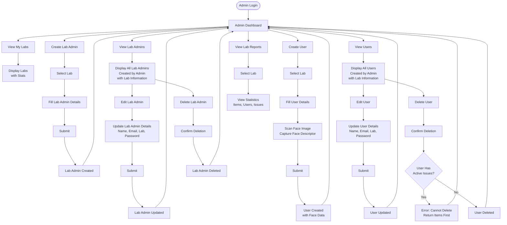

### 2.3 Lab Admin Flow

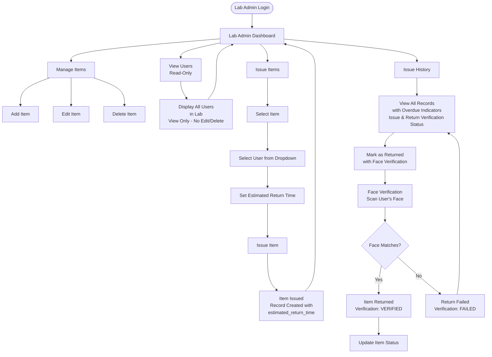

### 2.4 User Flow

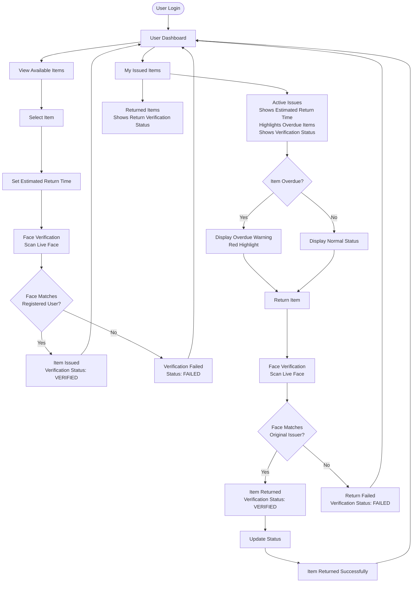

## 3. Entity Relationship Diagram (ERD) - Updated

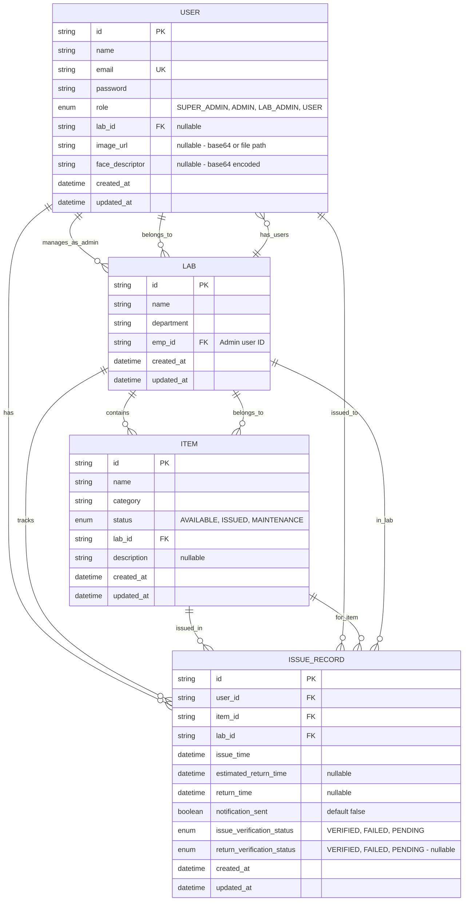

## 4. Database Schema Details - Updated

### User Entity
- **id**: Primary Key (ObjectId)
- **name**: String
- **email**: String (Unique)
- **password**: String (Hashed with bcrypt)
- **role**: Enum (SUPER_ADMIN, ADMIN, LAB_ADMIN, USER)
- **lab_id**: Foreign Key to Lab (Optional - for LAB_ADMIN and USER)
- **image_url**: String (Optional) - Base64 encoded image or file path
- **face_descriptor**: String (Optional) - Base64 encoded face descriptor for face recognition
- **created_at**: DateTime
- **updated_at**: DateTime

### Lab Entity
- **id**: Primary Key (ObjectId)
- **name**: String
- **department**: String
- **emp_id**: Foreign Key to User (Admin who manages this lab)
- **created_at**: DateTime
- **updated_at**: DateTime

### Item Entity
- **id**: Primary Key (ObjectId)
- **name**: String
- **category**: String
- **status**: Enum (AVAILABLE, ISSUED, MAINTENANCE)
- **lab_id**: Foreign Key to Lab
- **description**: String (Optional)
- **created_at**: DateTime
- **updated_at**: DateTime

### IssueRecord Entity - Updated
- **id**: Primary Key (ObjectId)
- **user_id**: Foreign Key to User
- **item_id**: Foreign Key to Item
- **lab_id**: Foreign Key to Lab
- **issue_time**: DateTime
- **estimated_return_time**: DateTime (Optional)
- **return_time**: DateTime (Optional)
- **notification_sent**: Boolean (Default: false)
- **issue_verification_status**: Enum (VERIFIED, FAILED, PENDING) - Face verification status when item was issued
- **return_verification_status**: Enum (VERIFIED, FAILED, PENDING) (Optional) - Face verification status when item was returned
- **created_at**: DateTime
- **updated_at**: DateTime

## 5. Role-Based Access Control Matrix - Updated

| Feature | Super Admin | Admin | Lab Admin | User |
|---------|------------|-------|-----------|------|
| Create Admin | ✅ | ❌ | ❌ | ❌ |
| Edit Admin | ✅ | ❌ | ❌ | ❌ |
| Delete Admin | ✅ | ❌ | ❌ | ❌ |
| Create Lab | ✅ | ❌ | ❌ | ❌ |
| Edit Lab | ✅ | ❌ | ❌ | ❌ |
| Delete Lab | ✅ | ❌ | ❌ | ❌ |
| Create User | ✅ | ✅ | ❌ | ❌ |
| Assign Admin to Lab | ✅ | ❌ | ❌ | ❌ |
| View All Admins | ✅ | ❌ | ❌ | ❌ |
| View All Labs | ✅ | ❌ | ❌ | ❌ |
| View All Users | ✅ | ✅ | ✅ | ❌ |
| View All Items | ✅ | ❌ | ❌ | ❌ |
| System Reports | ✅ | ❌ | ❌ | ❌ |
| View My Labs | ❌ | ✅ | ❌ | ❌ |
| Create Lab Admin | ❌ | ✅ | ❌ | ❌ |
| Edit Lab Admin | ❌ | ✅ | ❌ | ❌ |
| Delete Lab Admin | ❌ | ✅ | ❌ | ❌ |
| View Lab Admins | ❌ | ✅ | ❌ | ❌ |
| Create User | ❌ | ✅ | ❌ | ❌ |
| Edit User | ❌ | ✅ | ❌ | ❌ |
| Delete User | ❌ | ✅ | ❌ | ❌ |
| View Users | ❌ | ✅ | ✅ | ❌ |
| View Lab Reports | ❌ | ✅ | ❌ | ❌ |
| Manage Items | ❌ | ❌ | ✅ | ❌ |
| Issue Items (with Estimated Return Time) | ❌ | ❌ | ✅ | ❌ |
| View Issue History | ❌ | ❌ | ✅ | ❌ |
| View Available Items | ❌ | ❌ | ❌ | ✅ |
| Request Item Issue | ❌ | ❌ | ❌ | ✅ |
| View My Issued Items (with Overdue Status) | ❌ | ❌ | ❌ | ✅ |
| Return Item | ❌ | ❌ | ✅ | ✅ |
| Receive Overdue Email Notifications | ❌ | ❌ | ❌ | ✅ |
| Receive Overdue Alert Emails | ❌ | ❌ | ✅ | ❌ |

## 6. API Endpoints Flow - Updated

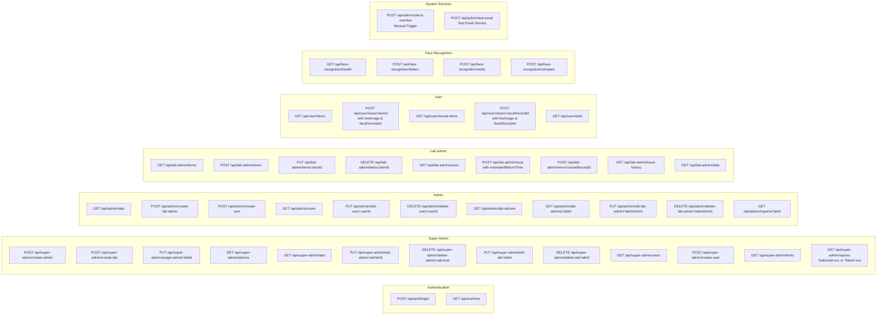

## 7. Email Notification System Flow

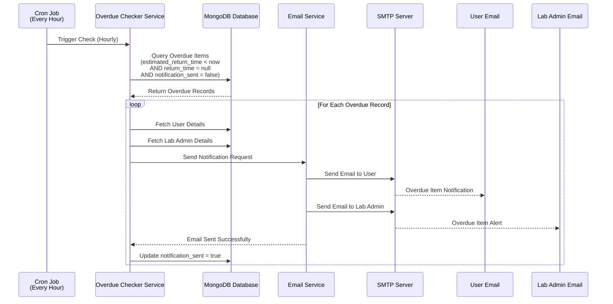

## 8. Overdue Item Detection & Notification Workflow

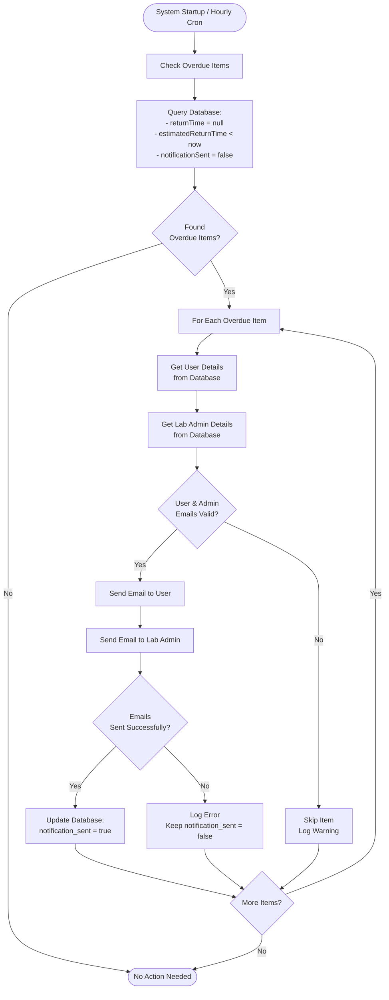

## 9. Issue Item Flow with Face Verification

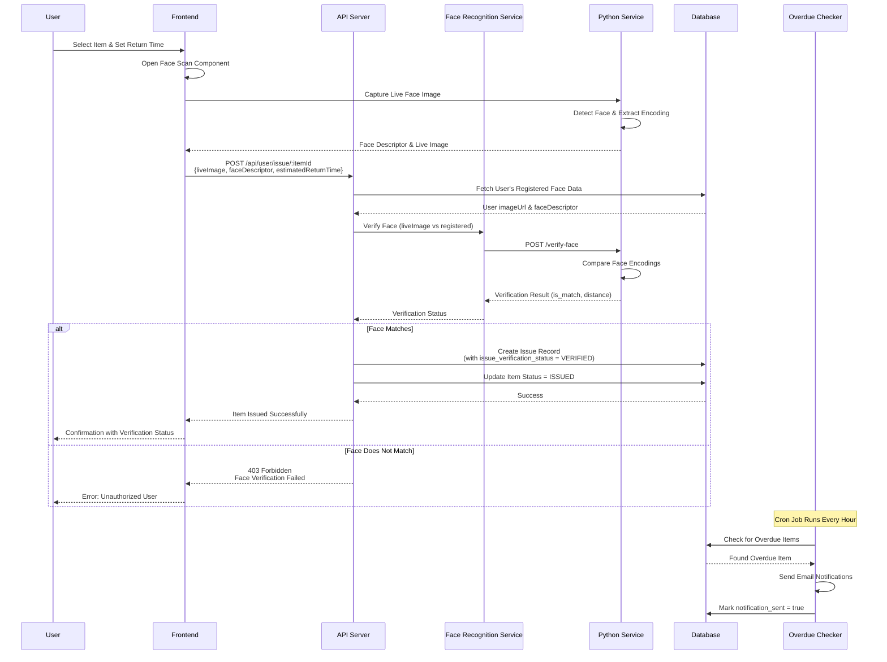

## 9.1. User Registration with Face Scanning

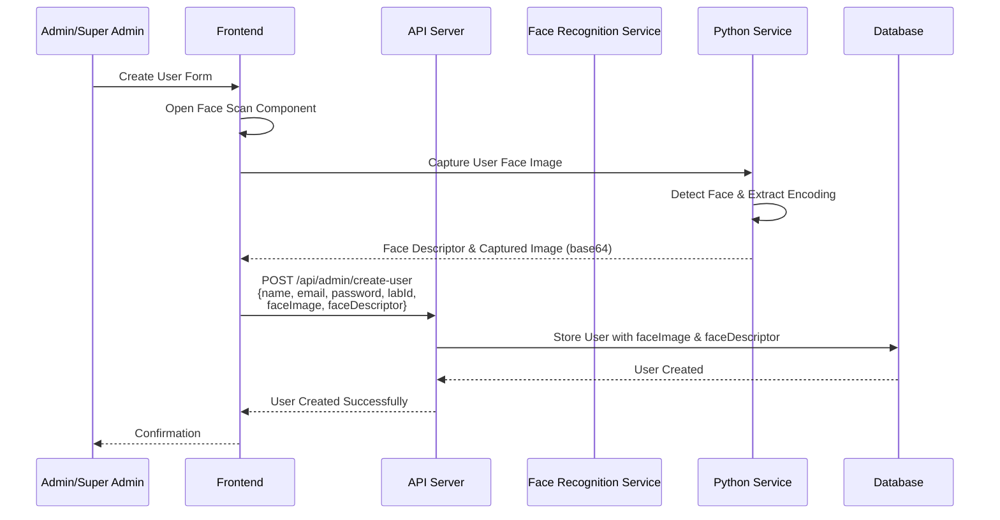

## 9.2. Face Verification Flow Diagram

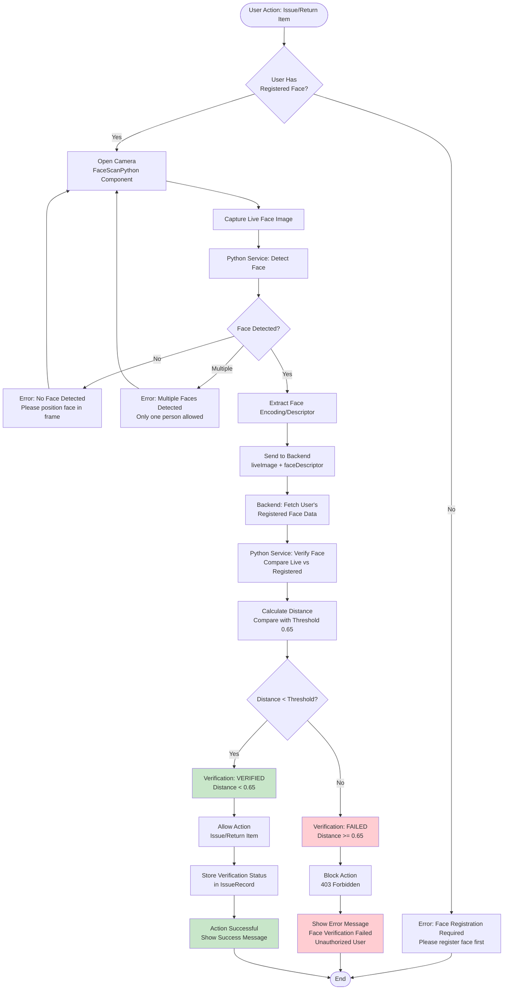

## 10. Data Flow Diagram - Updated

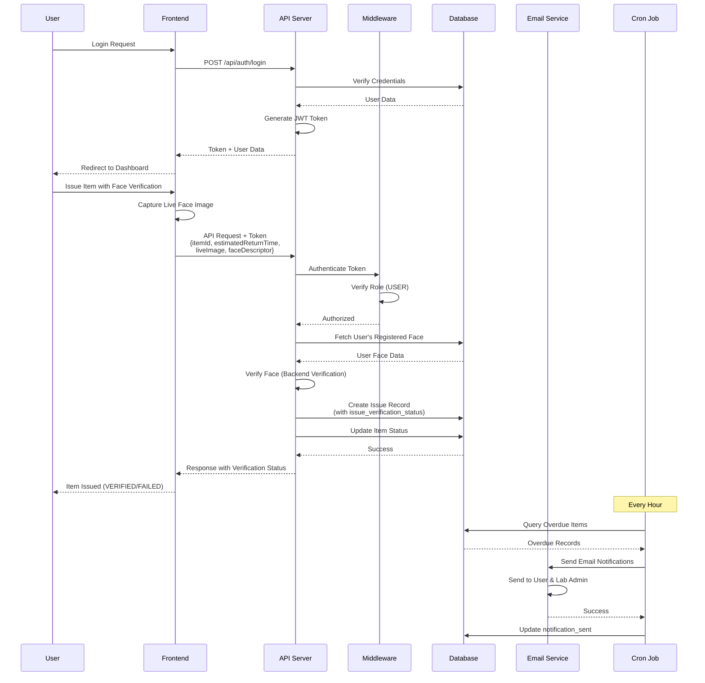

## 11. System Components Overview - Updated

```mermaid
graph TB
    subgraph "Frontend Components"
        LOGIN_PAGE[Login Page]
        DASHBOARDS[Dashboards<br/>Role-Based]
        FORMS[Forms<br/>Create/Edit<br/>with DateTime Picker]
        TABLES[Tables<br/>Data Display<br/>with Overdue Indicators<br/>Verification Status]
        SIDEBAR[Sidebar Navigation]
        FACE_SCAN[FaceScanPython Component<br/>Camera & Face Detection]
    end
    
    subgraph "Backend Services"
        AUTH_SERVICE[Authentication Service]
        RBAC_SERVICE[Role-Based Access Control]
        USER_SERVICE[User Management]
        LAB_SERVICE[Lab Management]
        ITEM_SERVICE[Item Management]
        ISSUE_SERVICE[Issue Management]
        FACE_SERVICE[Face Recognition Service<br/>Node.js Intermediary]
        EMAIL_SERVICE[Email Service<br/>Nodemailer]
        OVERDUE_SERVICE[Overdue Checker Service<br/>Cron Job]
    end
    
    subgraph "Python Service"
        PYTHON_FACE[Python Flask Service<br/>Face Detection & Verification]
    end
    
    subgraph "Middleware"
        AUTH_MW[Authentication Middleware]
        AUTHORIZE_MW[Authorization Middleware]
        ERROR_MW[Error Handling]
    end
    
    subgraph "Database"
        MONGO[(MongoDB)]
        PRISMA_CLIENT[Prisma Client]
        MONGOOSE[Direct MongoDB Access]
    end
    
    subgraph "External"
        SMTP_SERVER[SMTP Server<br/>Gmail/Email Provider]
    end
    
    LOGIN_PAGE --> AUTH_SERVICE
    DASHBOARDS --> USER_SERVICE
    DASHBOARDS --> LAB_SERVICE
    DASHBOARDS --> ITEM_SERVICE
    DASHBOARDS --> ISSUE_SERVICE
    FORMS --> USER_SERVICE
    FORMS --> LAB_SERVICE
    FORMS --> ITEM_SERVICE
    FORMS --> ISSUE_SERVICE
    
    AUTH_SERVICE --> AUTH_MW
    USER_SERVICE --> AUTHORIZE_MW
    LAB_SERVICE --> AUTHORIZE_MW
    ITEM_SERVICE --> AUTHORIZE_MW
    ISSUE_SERVICE --> AUTHORIZE_MW
    FACE_SERVICE --> AUTHORIZE_MW
    
    AUTH_MW --> RBAC_SERVICE
    AUTHORIZE_MW --> RBAC_SERVICE
    
    USER_SERVICE --> PRISMA_CLIENT
    LAB_SERVICE --> PRISMA_CLIENT
    ITEM_SERVICE --> PRISMA_CLIENT
    ISSUE_SERVICE --> PRISMA_CLIENT
    OVERDUE_SERVICE --> PRISMA_CLIENT
    FACE_SERVICE --> PRISMA_CLIENT
    
    USER_SERVICE --> MONGOOSE
    LAB_SERVICE --> MONGOOSE
    ITEM_SERVICE --> MONGOOSE
    ISSUE_SERVICE --> MONGOOSE
    OVERDUE_SERVICE --> MONGOOSE
    
    FACE_SERVICE --> PYTHON_FACE
    ISSUE_SERVICE --> FACE_SERVICE
    
    OVERDUE_SERVICE --> EMAIL_SERVICE
    EMAIL_SERVICE --> SMTP_SERVER
    
    PRISMA_CLIENT --> MONGO
    MONGOOSE --> MONGO
```

## 13. Authentication & Authorization Flow

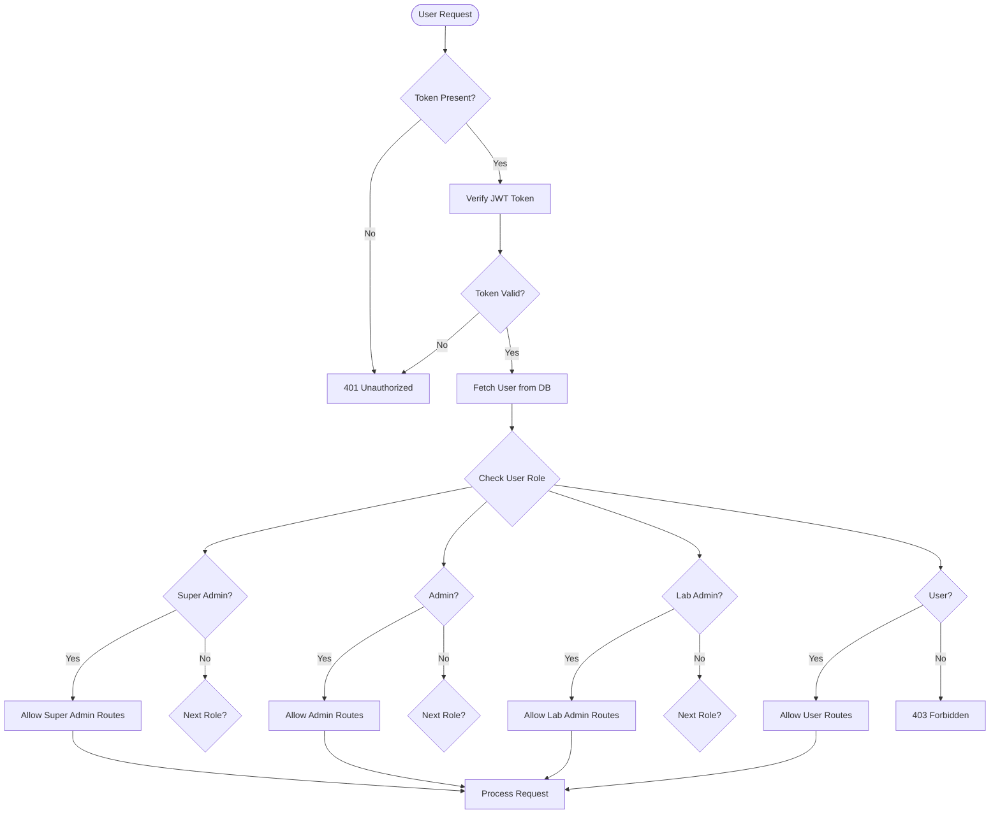

## 14. Issue/Return Workflow with Overdue Tracking

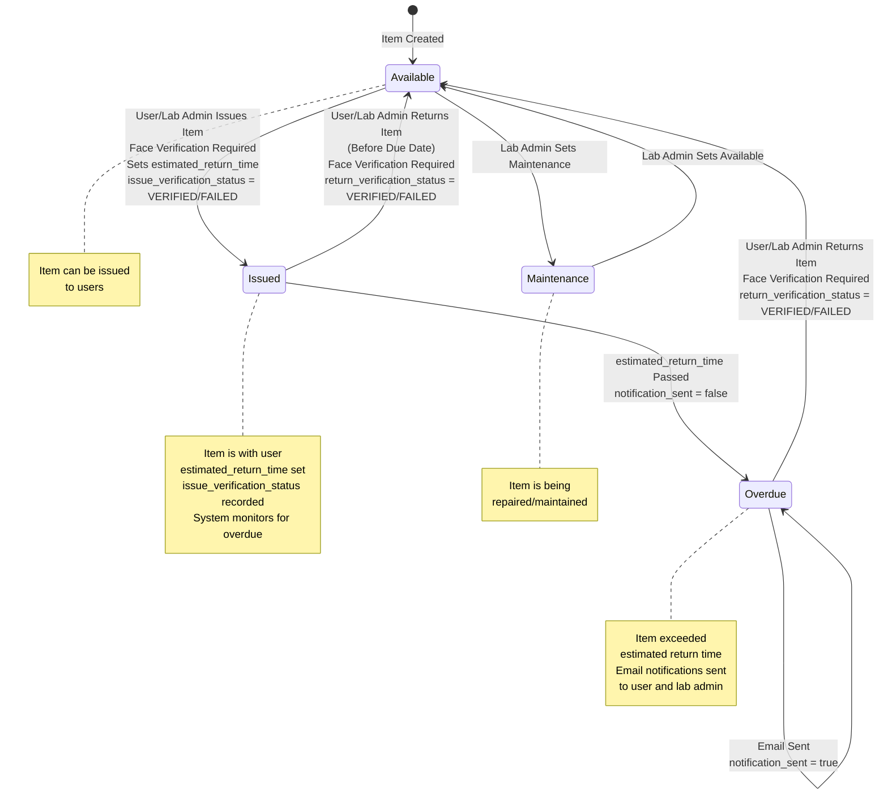

## 15. Complete System Overview

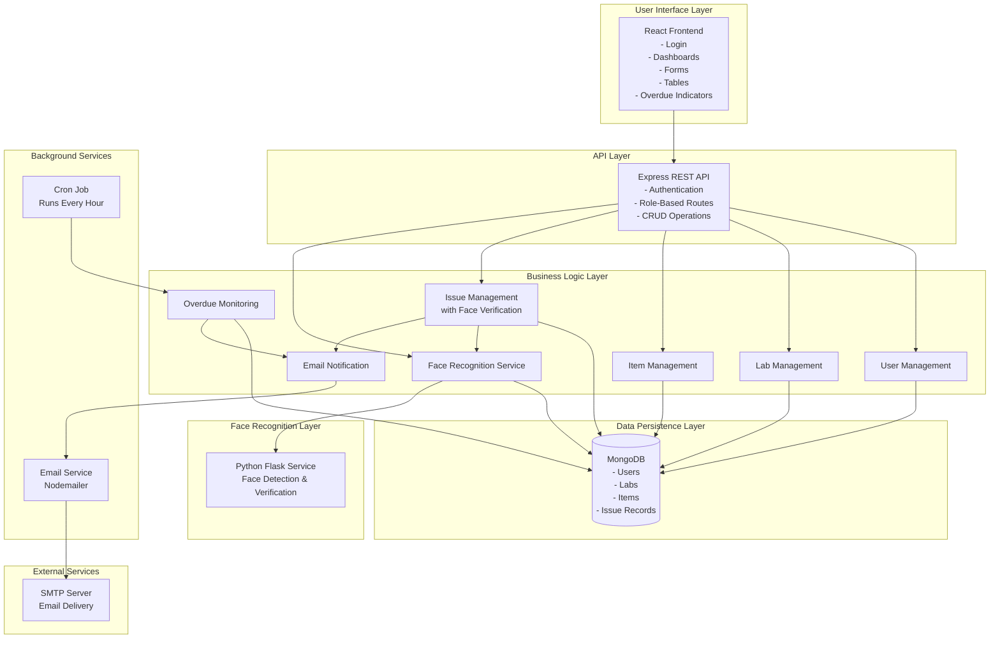

## 16. Project Flow Diagram

```mermaid
flowchart TD
    START([Project Start]) --> INIT[System Initialization]
    
    INIT --> SETUP_DB[Setup MongoDB Database]
    SETUP_DB --> SETUP_PRISMA[Configure Prisma Schema]
    SETUP_PRISMA --> SEED[Seed Initial Data<br/>Super Admin Account]
    
    SEED --> DEPLOY[Deploy Application]
    DEPLOY --> READY[System Ready]
    
    READY --> LOGIN_PAGE[Login Page]
    LOGIN_PAGE --> AUTH_CHECK{Authentication<br/>Success?}
    
    AUTH_CHECK -->|No| LOGIN_PAGE
    AUTH_CHECK -->|Yes| ROLE_CHECK{User Role?}
    
    ROLE_CHECK -->|SUPER_ADMIN| SA_FLOW[Super Admin Flow]
    ROLE_CHECK -->|ADMIN| AD_FLOW[Admin Flow]
    ROLE_CHECK -->|LAB_ADMIN| LA_FLOW[Lab Admin Flow]
    ROLE_CHECK -->|USER| U_FLOW[User Flow]
    
    subgraph "Super Admin Flow"
        SA_FLOW --> SA_DASH[Super Admin Dashboard]
        SA_DASH --> SA_CREATE_ADMIN[Create Admin Account]
        SA_DASH --> SA_CREATE_LAB[Create Laboratory]
        SA_DASH --> SA_ASSIGN[Assign Admin to Lab]
        SA_DASH --> SA_VIEW[View Admins & Labs]
        
        SA_CREATE_ADMIN --> SA_DASH
        SA_CREATE_LAB --> SA_DASH
        SA_ASSIGN --> SA_DASH
        
        SA_VIEW --> SA_EDIT_ADMIN[Edit Admin]
        SA_VIEW --> SA_DELETE_ADMIN[Delete Admin]
        SA_VIEW --> SA_EDIT_LAB[Edit Lab]
        SA_VIEW --> SA_DELETE_LAB[Delete Lab]
        
        SA_EDIT_ADMIN --> SA_DASH
        SA_DELETE_ADMIN --> SA_DASH
        SA_EDIT_LAB --> SA_DASH
        SA_DELETE_LAB --> SA_DASH
        
        SA_DASH --> SA_CREATE_USER[Create User]
        SA_DASH --> SA_VIEW_USERS[View All Users]
        SA_DASH --> SA_VIEW_ITEMS[View All Items<br/>with Status & Lab Info]
        SA_DASH --> SA_REPORTS[System Reports]
        
        SA_CREATE_USER --> SA_DASH
        SA_VIEW_USERS --> SA_DASH
        SA_VIEW_ITEMS --> SA_DASH
        
        SA_REPORTS --> SA_OVERVIEW[System Overview<br/>All Admins, Labs, Users,<br/>Lab Admins, Items with States, Issues]
        SA_REPORTS --> SA_ADMIN_REPORT[Admin Report]
        SA_REPORTS --> SA_LAB_REPORT[Lab Report]
        SA_OVERVIEW --> SA_DASH
        SA_ADMIN_REPORT --> SA_DASH
        SA_LAB_REPORT --> SA_DASH
    end
    
    subgraph "Admin Flow"
        AD_FLOW --> AD_DASH[Admin Dashboard]
        AD_DASH --> AD_VIEW_LABS[View My Labs]
        AD_DASH --> AD_CREATE_LA[Create Lab Admin]
        AD_DASH --> AD_CREATE_USER[Create User]
        AD_DASH --> AD_VIEW_USERS[View Users]
        AD_DASH --> AD_VIEW_LA[View Lab Admins]
        AD_DASH --> AD_REPORTS[View Lab Reports]
        
        AD_VIEW_LABS --> AD_DASH
        AD_CREATE_LA --> AD_DASH
        AD_CREATE_USER --> AD_DASH
        
        AD_VIEW_USERS --> AD_EDIT_USER[Edit User]
        AD_VIEW_USERS --> AD_DELETE_USER[Delete User]
        AD_EDIT_USER --> AD_DASH
        AD_DELETE_USER --> AD_DASH
        
        AD_VIEW_LA --> AD_EDIT_LA[Edit Lab Admin]
        AD_VIEW_LA --> AD_DELETE_LA[Delete Lab Admin]
        AD_EDIT_LA --> AD_DASH
        AD_DELETE_LA --> AD_DASH
        
        AD_REPORTS --> AD_DASH
    end
    
    subgraph "Lab Admin Flow"
        LA_FLOW --> LA_DASH[Lab Admin Dashboard]
        LA_DASH --> LA_MANAGE_ITEMS[Manage Items<br/>Add/Edit/Delete]
        LA_DASH --> LA_VIEW_USERS[View Users<br/>Read-Only]
        LA_DASH --> LA_ISSUE[Issue Items to Users<br/>Set Estimated Return Time]
        LA_DASH --> LA_HISTORY[View Issue History<br/>Mark Returns]
        
        LA_MANAGE_ITEMS --> LA_DASH
        LA_VIEW_USERS --> LA_DASH
        
        LA_ISSUE --> LA_DASH
        LA_HISTORY --> LA_DASH
    end
    
    subgraph "User Flow"
        U_FLOW --> U_DASH[User Dashboard]
        U_DASH --> U_VIEW_ITEMS[View Available Items]
        U_DASH --> U_MY_ITEMS[My Issued Items<br/>Check Overdue Status]
        
        U_VIEW_ITEMS --> U_SELECT_ITEM[Select Item]
        U_SELECT_ITEM --> U_SET_RETURN_TIME[Set Estimated Return Time]
        U_SET_RETURN_TIME --> U_FACE_SCAN_ISSUE[Face Verification<br/>Scan Live Face]
        U_FACE_SCAN_ISSUE --> U_VERIFY_ISSUE{Face Matches?}
        U_VERIFY_ISSUE -->|Yes| U_ISSUE_SUCCESS[Item Issued<br/>Verification: VERIFIED]
        U_VERIFY_ISSUE -->|No| U_ISSUE_FAIL[Issue Failed<br/>Verification: FAILED]
        U_ISSUE_SUCCESS --> U_DASH
        U_ISSUE_FAIL --> U_DASH
        
        U_MY_ITEMS --> U_CHECK_OVERDUE{Item Overdue?}
        U_CHECK_OVERDUE -->|Yes| U_OVERDUE_WARNING[Display Overdue Warning<br/>Show Verification Status]
        U_CHECK_OVERDUE -->|No| U_NORMAL[Display Normal Status<br/>Show Verification Status]
        
        U_OVERDUE_WARNING --> U_RETURN[Return Item]
        U_NORMAL --> U_RETURN
        U_RETURN --> U_FACE_SCAN_RETURN[Face Verification<br/>Scan Live Face]
        U_FACE_SCAN_RETURN --> U_VERIFY_RETURN{Face Matches<br/>Original Issuer?}
        U_VERIFY_RETURN -->|Yes| U_RETURN_SUCCESS[Item Returned<br/>Verification: VERIFIED]
        U_VERIFY_RETURN -->|No| U_RETURN_FAIL[Return Failed<br/>Verification: FAILED]
        U_RETURN_SUCCESS --> U_DASH
        U_RETURN_FAIL --> U_DASH
    end
    
    subgraph "Background Processes"
        CRON_START([System Startup]) --> CRON_INIT[Initialize Cron Job]
        CRON_INIT --> CRON_SCHEDULE[Schedule Hourly Check]
        CRON_SCHEDULE --> CRON_LOOP[Every Hour]
        
        CRON_LOOP --> CHECK_OVERDUE[Check Overdue Items]
        CHECK_OVERDUE --> QUERY_DB[Query Database<br/>for Overdue Records]
        QUERY_DB --> FOUND_OVERDUE{Found<br/>Overdue Items?}
        
        FOUND_OVERDUE -->|No| CRON_LOOP
        FOUND_OVERDUE -->|Yes| SEND_EMAILS[Send Email Notifications<br/>to User & Lab Admin]
        SEND_EMAILS --> UPDATE_FLAG[Update notification_sent = true]
        UPDATE_FLAG --> CRON_LOOP
    end
    
    LA_ISSUE --> CREATE_RECORD[Create Issue Record<br/>with estimated_return_time]
    CREATE_RECORD --> UPDATE_ITEM_STATUS[Update Item Status = ISSUED]
    UPDATE_ITEM_STATUS --> MONITOR[System Monitors for Overdue]
    
    U_FACE_SCAN_ISSUE --> CREATE_RECORD_USER[Create Issue Record<br/>with issue_verification_status]
    CREATE_RECORD_USER --> UPDATE_ITEM_STATUS_USER[Update Item Status = ISSUED]
    UPDATE_ITEM_STATUS_USER --> MONITOR
    
    MONITOR --> CHECK_OVERDUE
    
    U_RETURN --> RETURN_PROCESS[Return Process<br/>with Face Verification]
    LA_HISTORY --> RETURN_PROCESS
    RETURN_PROCESS --> VERIFY_RETURN_FACE[Verify Face Matches Original Issuer]
    VERIFY_RETURN_FACE --> UPDATE_RETURN_TIME[Update return_time &<br/>return_verification_status in Record]
    UPDATE_RETURN_TIME --> UPDATE_ITEM_AVAILABLE[Update Item Status = AVAILABLE]
    UPDATE_ITEM_AVAILABLE --> U_DASH
    UPDATE_ITEM_AVAILABLE --> LA_DASH
    
    style START fill:#e1f5ff
    style READY fill:#c8e6c9
    style SA_FLOW fill:#fff9c4
    style AD_FLOW fill:#e1bee7
    style LA_FLOW fill:#b3e5fc
    style U_FLOW fill:#c5e1a5
    style CRON_START fill:#ffccbc
    style MONITOR fill:#f8bbd0
```

---

## Notes

- All diagrams use Mermaid syntax and can be rendered in:
  - GitHub Markdown
  - VS Code with Mermaid extension
  - Online Mermaid editors (mermaid.live)
  - Documentation tools that support Mermaid

### Key Updates in This Version:

1. **Face Recognition System**: 
   - Python Flask service for face detection and verification
   - Face scanning during user registration
   - Face verification required for item issue and return
   - Face verification status tracking (VERIFIED, FAILED, PENDING)
   - Base64 image storage in database
   - Face descriptor storage for faster verification

2. **Email Notification System**: Added email service and SMTP integration
3. **Overdue Checker Service**: Added cron job for automatic overdue detection
4. **Estimated Return Time**: New field in IssueRecord for tracking expected return dates
5. **Notification Tracking**: `notification_sent` field to prevent duplicate emails
6. **Updated User Flows**: 
   - Users can issue items themselves with face verification
   - Face verification required for both issue and return
   - Verification status displayed in issue history
7. **Updated ERD**: Includes new fields:
   - `image_url` and `face_descriptor` in User model
   - `issue_verification_status` and `return_verification_status` in IssueRecord model
   - `estimated_return_time`, `notification_sent`
8. **New API Endpoints**: 
   - Face recognition endpoints (`/api/face-recognition/*`)
   - Updated user issue endpoint with face verification
   - Updated return endpoint with face verification

### System Features:

- **MongoDB** with Prisma ORM for most operations
- **Direct MongoDB operations** (via Mongoose) for create/update to avoid transaction requirements
- **JWT tokens** for authentication with 7-day expiration
- **Role-based access control** enforced at middleware level
- **Face Recognition**: Python-based service for secure face verification
- **User Self-Service**: Users can issue items themselves after face verification
- **Automatic overdue detection** via cron job (runs every hour)
- **Email notifications** sent to both users and lab admins for overdue items
- **Data consistency checks** and automatic fixes in overdue checker
- **Verification Status Tracking**: Complete audit trail of face verification for all issue and return operations
