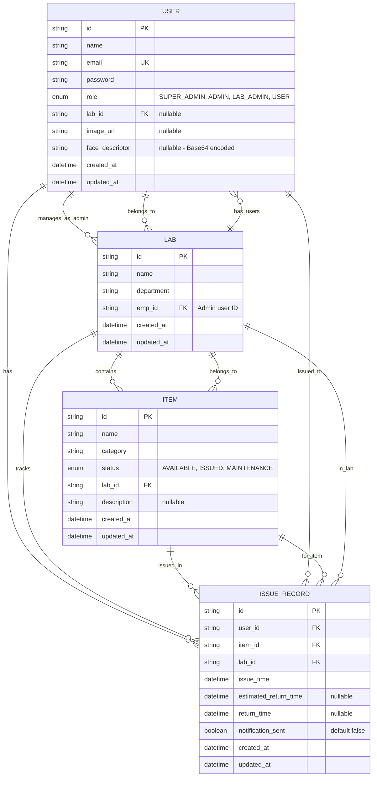

# Laboratory Items Issue Management System
## Project Source Documentation

> **Note**: For detailed Business Process Model and Notation (BPMN) diagrams, see [BPMN_DIAGRAMS.md](./BPMN_DIAGRAMS.md)

---

## Project Title

**Laboratory Items Issue Management System with Face Recognition-Based Authentication**

A comprehensive full-stack web application designed to manage laboratory equipment and items with role-based access control, automated tracking, and biometric face recognition for secure item issuance.

---

## 1. Project Abstract

The Laboratory Items Issue Management System is a modern, secure, and efficient solution for managing laboratory equipment and items in educational and research institutions. The system addresses the critical need for automated tracking, accountability, and security in laboratory item management.

### Key Highlights:

- **Multi-Tenant Architecture**: Supports multiple laboratories with isolated data management
- **Role-Based Access Control**: Four-tier hierarchical access system (Super Admin, Admin, Lab Admin, User)
- **Biometric Security**: Face recognition technology for secure item issuance and verification
- **Automated Tracking**: Real-time tracking of item status, issue history, and return management
- **Automated Notifications**: Email alerts for overdue items to ensure timely returns
- **User Self-Service**: Users can issue items themselves with face verification, reducing administrative overhead
- **Comprehensive Reporting**: Analytics and statistics for all stakeholders

### Technology Stack:

- **Frontend**: React 18.2.0, Tailwind CSS, Vite
- **Backend**: Node.js, Express.js, MongoDB, Prisma ORM
- **Authentication**: JWT-based authentication with role-based authorization
- **Face Recognition**: Python Flask microservice with OpenCV and face_recognition library
- **Email Service**: Nodemailer for automated email notifications
- **File Management**: Multer for user image uploads

### Problem Statement:

Traditional laboratory item management systems suffer from:
- Manual tracking leading to errors and loss
- Lack of accountability and audit trails
- Security vulnerabilities in item issuance
- Inefficient notification systems for overdue items
- Limited user self-service capabilities
- Poor visibility into item usage patterns

### Solution:

This system provides a centralized, automated, and secure platform that:
- Eliminates manual errors through automated tracking
- Ensures accountability with comprehensive audit trails
- Enhances security with biometric face verification
- Automates notifications for better compliance
- Empowers users with self-service capabilities
- Provides actionable insights through analytics

---

## 2. Project Goals

### 2.1 Primary Goals

1. **Automated Item Management**
   - Streamline the process of issuing and returning laboratory items
   - Eliminate manual record-keeping and reduce human errors
   - Provide real-time visibility into item availability and status

2. **Enhanced Security**
   - Implement face recognition-based verification for item issuance
   - Ensure only authorized users can issue items
   - Prevent unauthorized access and misuse of laboratory equipment

3. **Multi-Level Access Control**
   - Implement hierarchical role-based access control
   - Ensure appropriate permissions for different user roles
   - Maintain data isolation between different laboratories

4. **User Experience**
   - Provide intuitive and responsive user interface
   - Enable self-service item issuance for users
   - Offer real-time feedback and notifications

5. **Accountability and Compliance**
   - Maintain comprehensive audit trails
   - Track all item movements and transactions
   - Generate reports for management and compliance

### 2.2 Secondary Goals

1. **Scalability**
   - Design system to handle multiple laboratories
   - Support growing number of users and items
   - Ensure performance with increasing data volume

2. **Maintainability**
   - Use modern development practices and frameworks
   - Implement clean code architecture
   - Ensure easy updates and feature additions

3. **Integration Capabilities**
   - Support integration with external systems
   - Provide RESTful API for third-party integrations
   - Enable data export and reporting

4. **Cost Efficiency**
   - Reduce administrative overhead
   - Minimize item loss and misuse
   - Optimize resource utilization

### 2.3 Success Criteria

- ✅ Successful implementation of all four user roles with appropriate permissions
- ✅ Face recognition verification working with >95% accuracy
- ✅ Automated email notifications for overdue items
- ✅ Real-time item status tracking
- ✅ User self-service item issuance functionality
- ✅ Comprehensive reporting and analytics
- ✅ System handling multiple laboratories simultaneously
- ✅ Responsive UI working on desktop and mobile devices

---

## 3. Project Flow Analysis

### 3.1 System Architecture Flow

```
┌─────────────────┐
│  Web Browser    │
│  (React UI)     │
└────────┬────────┘
         │
         │ HTTP Requests
         │
┌────────▼────────┐
│  Express.js     │
│  REST API       │
└────────┬────────┘
         │
         ├──────────────┐
         │              │
┌────────▼────────┐  ┌─▼──────────────────┐
│  JWT Auth       │  │  Face Recognition   │
│  Middleware     │  │  Python Service    │
└────────┬────────┘  └────────────────────┘
         │
         │
┌────────▼────────┐
│  Route Handlers │
│  (Role-Based)   │
└────────┬────────┘
         │
         ├──────────────┐
         │              │
┌────────▼────────┐  ┌─▼──────────────┐
│  Prisma ORM    │  │  Mongoose      │
│  (Reads)       │  │  (Writes)      │
└────────┬────────┘  └─┬──────────────┘
         │              │
         └──────┬───────┘
                │
         ┌──────▼──────┐
         │  MongoDB   │
         │  Database  │
         └────────────┘
```

### 3.2 Authentication Flow

```
User Login
    │
    ├─► Validate Credentials
    │
    ├─► Generate JWT Token
    │
    ├─► Store Token (LocalStorage)
    │
    └─► Redirect to Role-Based Dashboard
```

### 3.3 Item Issuance Flow (With Face Recognition)

```
1. Select Item & User
    │
2. Set Estimated Return Time
    │
3. Initiate Face Scan
    │
    ├─► Access Camera
    │
    ├─► Capture Face Image
    │
    ├─► Send to Python Service
    │
    ├─► Compare with Stored Face
    │
    ├─► Verification Result
    │
    │   ├─► Match: Issue Item
    │   │
    │   └─► Mismatch: Show Error
    │
4. Create Issue Record
    │
5. Update Item Status
    │
6. Send Confirmation
```

### 3.4 Overdue Item Notification Flow

```
Cron Job (Daily Check)
    │
    ├─► Query Issue Records
    │
    ├─► Check Estimated Return Time
    │
    ├─► Identify Overdue Items
    │
    ├─► Filter Unnotified Records
    │
    ├─► Generate Email Notifications
    │
    ├─► Send Emails to Users
    │
    └─► Mark notification_sent = true
```

### 3.5 User Role Hierarchy Flow

```
Super Admin
    │
    ├─► Create Admin
    │
    ├─► Create Lab
    │
    ├─► Assign Admin to Lab
    │
    └─► System-Wide Reports

Admin
    │
    ├─► Manage Assigned Labs
    │
    ├─► Create Lab Admin
    │
    ├─► Create Users
    │
    └─► View Lab Reports

Lab Admin
    │
    ├─► Manage Items (CRUD)
    │
    ├─► Issue Items (with Face Verification)
    │
    ├─► View Issue History
    │
    └─► Mark Items as Returned

User
    │
    ├─► View Available Items
    │
    ├─► Issue Items (Self-Service with Face Verification)
    │
    ├─► View Issued Items
    │
    └─► Return Items
```

### 3.6 Data Flow Diagram

```
┌──────────────┐
│   Frontend   │
│   (React)    │
└──────┬───────┘
       │
       │ HTTP Request
       │ (JSON Data)
       │
┌──────▼──────────────────────────────┐
│         Backend (Express.js)        │
│                                     │
│  ┌──────────────┐  ┌─────────────┐ │
│  │   Routes     │  │  Middleware │ │
│  │  (Handlers)  │  │  (Auth)     │ │
│  └──────┬───────┘  └──────┬──────┘ │
│         │                 │        │
│  ┌──────▼─────────────────▼──────┐ │
│  │      Services Layer          │ │
│  │  - Email Service             │ │
│  │  - Face Recognition Service  │ │
│  │  - Overdue Checker Service   │ │
│  └──────┬───────────────────────┘ │
│         │                          │
└─────────┼──────────────────────────┘
          │
          │ Database Operations
          │
┌─────────▼─────────┐
│     MongoDB       │
│   (Collections)   │
│                   │
│  - users          │
│  - labs           │
│  - items          │
│  - issue_records  │
└───────────────────┘
```

---

## 4. ER Diagram

### 4.1 Entity Relationship Diagram



### 4.2 Relationship Descriptions

1. **USER ↔ LAB (Many-to-Many)**
   - A User can manage multiple Labs (as Admin)
   - A User belongs to one Lab (as Lab Admin or User)
   - A Lab has one Admin (emp_id)
   - A Lab has many Users (lab_id)

2. **LAB ↔ ITEM (One-to-Many)**
   - A Lab contains many Items
   - An Item belongs to one Lab

3. **USER ↔ ISSUE_RECORD (One-to-Many)**
   - A User can have many Issue Records
   - An Issue Record belongs to one User

4. **ITEM ↔ ISSUE_RECORD (One-to-Many)**
   - An Item can have many Issue Records (over time)
   - An Issue Record is for one Item

5. **LAB ↔ ISSUE_RECORD (One-to-Many)**
   - A Lab tracks many Issue Records
   - An Issue Record belongs to one Lab

### 4.3 Database Schema Details

#### User Entity
- **id**: Primary Key (ObjectId)
- **name**: String (Required)
- **email**: String (Unique, Required)
- **password**: String (Hashed with bcrypt, Required)
- **role**: Enum (SUPER_ADMIN, ADMIN, LAB_ADMIN, USER)
- **lab_id**: Foreign Key to Lab (Optional - for LAB_ADMIN and USER)
- **image_url**: String (Optional - Path to user profile image)
- **face_descriptor**: String (Optional - Base64 encoded face encoding)
- **created_at**: DateTime (Auto-generated)
- **updated_at**: DateTime (Auto-updated)

#### Lab Entity
- **id**: Primary Key (ObjectId)
- **name**: String (Required)
- **department**: String (Required)
- **emp_id**: Foreign Key to User (Required - Admin who manages this lab)
- **created_at**: DateTime (Auto-generated)
- **updated_at**: DateTime (Auto-updated)

#### Item Entity
- **id**: Primary Key (ObjectId)
- **name**: String (Required)
- **category**: String (Required)
- **status**: Enum (AVAILABLE, ISSUED, MAINTENANCE) - Default: AVAILABLE
- **lab_id**: Foreign Key to Lab (Required)
- **description**: String (Optional)
- **created_at**: DateTime (Auto-generated)
- **updated_at**: DateTime (Auto-updated)

#### IssueRecord Entity
- **id**: Primary Key (ObjectId)
- **user_id**: Foreign Key to User (Required)
- **item_id**: Foreign Key to Item (Required)
- **lab_id**: Foreign Key to Lab (Required)
- **issue_time**: DateTime (Required, Default: Now)
- **estimated_return_time**: DateTime (Optional)
- **return_time**: DateTime (Optional)
- **notification_sent**: Boolean (Default: false)
- **created_at**: DateTime (Auto-generated)
- **updated_at**: DateTime (Auto-updated)

---

## 5. Functional Requirements (Overall Modules)

### 5.1 Authentication Module

**FR-AUTH-001**: User Login
- Users can log in with email and password
- System validates credentials against database
- System generates JWT token upon successful authentication
- System stores token for session management

**FR-AUTH-002**: Session Management
- System maintains user session using JWT tokens
- System validates token on each protected request
- System redirects to login on token expiration

**FR-AUTH-003**: Role-Based Access Control
- System identifies user role from token
- System restricts access based on role permissions
- System provides role-specific dashboards

### 5.2 User Management Module

**FR-USER-001**: Create User
- Super Admin and Admin can create users
- System validates email uniqueness
- System hashes password before storage
- System allows optional image upload during creation
- System allows optional face descriptor capture

**FR-USER-002**: View Users
- Admins can view users in their assigned labs
- Lab Admins can view users in their lab (read-only)
- System displays user details including image and lab information

**FR-USER-003**: Edit User
- Admins can edit user details
- System validates email uniqueness on update
- System allows password updates

**FR-USER-004**: Delete User
- Admins can delete users
- System prevents deletion if user has active issue records
- System requires confirmation before deletion

### 5.3 Laboratory Management Module

**FR-LAB-001**: Create Laboratory
- Super Admin can create laboratories
- System requires lab name and department
- System assigns admin to lab

**FR-LAB-002**: View Laboratories
- Super Admin can view all laboratories
- Admins can view their assigned laboratories
- System displays lab details and associated admin

**FR-LAB-003**: Assign Admin to Lab
- Super Admin can assign admins to laboratories
- System updates lab-admin relationship
- System allows reassignment

### 5.4 Item Management Module

**FR-ITEM-001**: Create Item
- Lab Admins can create items in their lab
- System requires item name, category, and description (optional)
- System sets initial status as AVAILABLE

**FR-ITEM-002**: View Items
- Lab Admins can view all items in their lab
- Users can view available items
- System displays item status, category, and description

**FR-ITEM-003**: Edit Item
- Lab Admins can edit item details
- System allows status updates (AVAILABLE, ISSUED, MAINTENANCE)
- System validates status transitions

**FR-ITEM-004**: Delete Item
- Lab Admins can delete items
- System prevents deletion if item is currently issued
- System requires confirmation before deletion

### 5.5 Item Issuance Module

**FR-ISSUE-001**: Issue Item (Lab Admin)
- Lab Admins can issue items to users
- System requires user selection and estimated return time
- System performs face verification before issuance
- System creates issue record upon successful verification
- System updates item status to ISSUED

**FR-ISSUE-002**: Issue Item (User Self-Service)
- Users can issue items themselves
- System requires estimated return time
- System performs face verification against user's stored face
- System creates issue record upon successful verification
- System updates item status to ISSUED

**FR-ISSUE-003**: Face Verification
- System accesses user's camera for face capture
- System sends captured image to Python face recognition service
- System compares live face with stored face descriptor or image
- System returns verification result (match/mismatch)
- System displays clear error message on mismatch

**FR-ISSUE-004**: View Issue History
- Lab Admins can view all issue records in their lab
- System displays issue details, user information, and status
- System highlights overdue items

### 5.6 Item Return Module

**FR-RETURN-001**: Return Item (User)
- Users can return items they have issued
- System requires confirmation before return
- System updates issue record with return time
- System updates item status to AVAILABLE

**FR-RETURN-002**: Mark as Returned (Lab Admin)
- Lab Admins can mark items as returned
- System updates issue record with return time
- System updates item status to AVAILABLE

### 5.7 Notification Module

**FR-NOTIF-001**: Overdue Item Detection
- System runs scheduled job to check overdue items
- System identifies items past estimated return time
- System filters items that haven't been notified

**FR-NOTIF-002**: Email Notification
- System sends email to user for overdue items
- System includes item details and issue information
- System marks notification_sent flag to prevent duplicates

### 5.8 Reporting Module

**FR-REPORT-001**: Dashboard Statistics
- All roles have access to relevant statistics
- Super Admin: System-wide statistics
- Admin: Lab-specific statistics
- Lab Admin: Lab statistics (items, users, issues)
- User: Personal statistics (issued items, overdue items)

**FR-REPORT-002**: Issue History Reports
- Lab Admins can view complete issue history
- System displays filtered and sorted records
- System shows overdue indicators

**FR-REPORT-003**: Lab Reports
- Admins can generate reports for assigned labs
- System provides statistics on items, users, and issues

### 5.9 Face Recognition Module

**FR-FACE-001**: Face Detection
- System can detect faces in captured images
- System validates single face presence
- System returns face encoding for storage

**FR-FACE-002**: Face Comparison
- System compares two face encodings
- System calculates similarity distance
- System returns match/mismatch result with confidence

**FR-FACE-003**: Face Verification
- System verifies live face against stored user face
- System supports both image URL and encoding comparison
- System provides detailed verification results

**FR-FACE-004**: Extract Encoding from Image
- System can extract face encoding from uploaded image file
- System validates image format and face presence
- System returns base64 encoded face descriptor

### 5.10 File Management Module

**FR-FILE-001**: Image Upload
- System accepts image files during user creation
- System validates file type (jpeg, jpg, png, gif, webp)
- System enforces file size limit (5MB)
- System stores files in uploads directory
- System generates unique filenames

**FR-FILE-002**: Image Serving
- System serves uploaded images statically
- System provides secure access to user images
- System handles missing file errors gracefully

---

## 6. Non-Functional Requirements

### 6.1 Performance Requirements

**NFR-PERF-001**: Response Time
- API endpoints should respond within 2 seconds under normal load
- Face recognition verification should complete within 5 seconds
- Page load time should be under 3 seconds

**NFR-PERF-002**: Throughput
- System should handle at least 100 concurrent users
- System should process at least 50 item issuances per minute
- Database queries should be optimized with proper indexing

**NFR-PERF-003**: Scalability
- System should support multiple laboratories simultaneously
- System should handle growing number of users and items
- Database should scale horizontally if needed

### 6.2 Security Requirements

**NFR-SEC-001**: Authentication Security
- Passwords must be hashed using bcrypt (minimum 10 rounds)
- JWT tokens must have expiration time
- Tokens must be stored securely (not in cookies for XSS protection)

**NFR-SEC-002**: Authorization Security
- Role-based access control must be enforced on all endpoints
- Users cannot access resources outside their permissions
- Face verification prevents unauthorized item issuance

**NFR-SEC-003**: Data Security
- Sensitive data (passwords, face descriptors) must be encrypted
- File uploads must be validated and sanitized
- SQL injection prevention through parameterized queries (Prisma)

**NFR-SEC-004**: Communication Security
- HTTPS should be used in production
- CORS must be properly configured
- API endpoints should validate input data

### 6.3 Reliability Requirements

**NFR-REL-001**: Availability
- System should have 99% uptime
- Graceful error handling for all operations
- Database connection pooling for reliability

**NFR-REL-002**: Error Handling
- System should handle errors gracefully
- User-friendly error messages
- Comprehensive logging for debugging

**NFR-REL-003**: Data Integrity
- Database transactions for critical operations
- Validation at both frontend and backend
- Data consistency checks

### 6.4 Usability Requirements

**NFR-USE-001**: User Interface
- Responsive design for desktop and mobile devices
- Intuitive navigation and clear visual feedback
- Accessible design following WCAG guidelines

**NFR-USE-002**: User Experience
- Clear error messages and success notifications
- Loading indicators for async operations
- Confirmation dialogs for critical actions

**NFR-USE-003**: Documentation
- Comprehensive user documentation
- API documentation for developers
- Setup and installation guides

### 6.5 Maintainability Requirements

**NFR-MAIN-001**: Code Quality
- Clean code architecture with separation of concerns
- Modular design for easy updates
- Comprehensive code comments

**NFR-MAIN-002**: Testing
- Unit tests for critical functions
- Integration tests for API endpoints
- End-to-end tests for user flows

**NFR-MAIN-003**: Version Control
- Git-based version control
- Meaningful commit messages
- Branching strategy for features and releases

### 6.6 Compatibility Requirements

**NFR-COMP-001**: Browser Compatibility
- Support for modern browsers (Chrome, Firefox, Safari, Edge)
- Progressive enhancement for older browsers
- Mobile browser support

**NFR-COMP-002**: Platform Compatibility
- Cross-platform support (Windows, Linux, macOS)
- Node.js version compatibility (v18+)
- Python version compatibility (3.8+)

**NFR-COMP-003**: Database Compatibility
- MongoDB version compatibility (4.4+)
- Prisma ORM compatibility
- Data migration support

### 6.7 Portability Requirements

**NFR-PORT-001**: Deployment
- Docker containerization support
- Environment-based configuration
- Easy deployment to cloud platforms

**NFR-PORT-002**: Configuration
- Environment variables for all configurations
- No hardcoded values
- Easy configuration updates

---

## 7. Existing System

### 7.1 Current State Analysis

#### 7.1.1 Traditional Manual Systems

**Characteristics:**
- Paper-based record keeping
- Manual entry in logbooks or spreadsheets
- No automated tracking or notifications
- Limited accountability and audit trails
- Time-consuming processes
- High error rates

**Limitations:**
- **Human Error**: Manual entry leads to mistakes in recording
- **Time Consumption**: Significant time spent on administrative tasks
- **Lack of Visibility**: No real-time status of items
- **Security Issues**: No verification of authorized users
- **Lost Items**: Difficulty tracking misplaced or lost items
- **No Automation**: Manual checking for overdue items
- **Limited Reporting**: Difficult to generate reports and analytics
- **Scalability Issues**: Cannot handle multiple laboratories efficiently

#### 7.1.2 Basic Digital Systems

**Characteristics:**
- Simple database applications
- Basic CRUD operations
- Limited user roles
- No integration capabilities
- Desktop-based or simple web applications

**Limitations:**
- **Limited Security**: Basic authentication without biometric verification
- **No Self-Service**: Users cannot issue items themselves
- **Manual Notifications**: No automated email alerts
- **Poor User Experience**: Outdated interfaces
- **Limited Access Control**: Basic role management
- **No Face Recognition**: No biometric security features
- **Limited Reporting**: Basic statistics only
- **No Multi-Tenancy**: Cannot handle multiple labs efficiently

### 7.2 Problems with Existing Systems

#### 7.2.1 Operational Problems

1. **Inefficient Item Tracking**
   - Manual processes lead to delays
   - Difficulty in locating items
   - No real-time status updates
   - Inaccurate inventory records

2. **Security Vulnerabilities**
   - No verification of authorized users
   - Easy to bypass security measures
   - No audit trail for accountability
   - Risk of unauthorized access

3. **Poor User Experience**
   - Complex and confusing interfaces
   - Limited self-service capabilities
   - No mobile accessibility
   - Poor error handling

4. **Administrative Overhead**
   - High time consumption for admins
   - Manual notification processes
   - Difficult report generation
   - Limited automation

#### 7.2.2 Technical Problems

1. **Outdated Technology**
   - Legacy systems with outdated frameworks
   - Poor performance and scalability
   - Security vulnerabilities
   - Difficult maintenance

2. **Integration Issues**
   - No API for third-party integrations
   - Limited data export capabilities
   - No microservices architecture
   - Monolithic design

3. **Data Management**
   - Poor database design
   - No data validation
   - Limited query capabilities
   - No backup and recovery mechanisms

### 7.3 Proposed System Advantages

#### 7.3.1 Operational Advantages

1. **Automated Tracking**
   - Real-time item status updates
   - Automated issue and return tracking
   - Comprehensive audit trails
   - Reduced manual errors

2. **Enhanced Security**
   - Face recognition-based verification
   - Role-based access control
   - Secure authentication with JWT
   - Comprehensive authorization

3. **Improved User Experience**
   - Modern, responsive user interface
   - Self-service item issuance
   - Real-time notifications
   - Mobile-friendly design

4. **Reduced Administrative Overhead**
   - Automated email notifications
   - Self-service capabilities
   - Automated reporting
   - Efficient workflow management

#### 7.3.2 Technical Advantages

1. **Modern Technology Stack**
   - React for responsive frontend
   - Node.js for scalable backend
   - MongoDB for flexible data storage
   - Python microservice for face recognition

2. **Scalable Architecture**
   - Microservices design
   - RESTful API architecture
   - Multi-tenant support
   - Horizontal scaling capability

3. **Robust Data Management**
   - Prisma ORM for type safety
   - Proper database indexing
   - Data validation at multiple layers
   - Comprehensive error handling

4. **Integration Capabilities**
   - RESTful API for integrations
   - Standard data formats (JSON)
   - Easy to extend and customize
   - Third-party service integration support

### 7.4 System Comparison

| Feature | Existing System | Proposed System |
|---------|----------------|-----------------|
| **Item Tracking** | Manual/Paper-based | Automated, Real-time |
| **User Verification** | None/Basic | Face Recognition |
| **Access Control** | Limited | 4-tier Role-Based |
| **Notifications** | Manual | Automated Email |
| **Self-Service** | Not Available | Available for Users |
| **Reporting** | Limited | Comprehensive Analytics |
| **Multi-Tenancy** | Not Supported | Full Support |
| **Mobile Access** | Limited/None | Fully Responsive |
| **API Integration** | Not Available | RESTful API |
| **Audit Trail** | Limited | Comprehensive |
| **Scalability** | Poor | Excellent |
| **User Experience** | Outdated | Modern UI/UX |

### 7.5 Migration Strategy

#### 7.5.1 Data Migration
- Export existing data from legacy systems
- Transform data to match new schema
- Import data into MongoDB
- Validate data integrity

#### 7.5.2 User Migration
- Create user accounts in new system
- Migrate user credentials (with password reset)
- Assign appropriate roles
- Upload user images if available

#### 7.5.3 Training
- Admin training for system management
- User training for self-service features
- Documentation and user guides
- Support during transition period

---

## Conclusion

The Laboratory Items Issue Management System represents a significant advancement over existing manual and basic digital systems. By incorporating modern technologies, automated processes, and biometric security, the system addresses all major limitations of current solutions while providing enhanced functionality, security, and user experience.

The system's modular architecture, comprehensive feature set, and robust non-functional requirements ensure it can serve as a reliable, scalable, and maintainable solution for laboratory item management in educational and research institutions.

---

**Document Version**: 1.0  
**Last Updated**: 2024  
**Author**: Development Team  
**Status**: Final

